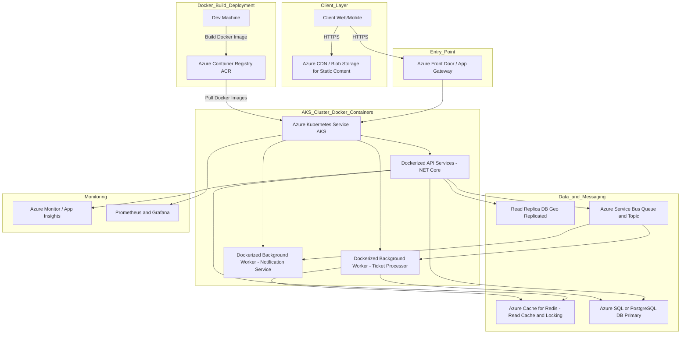

```mermaid
graph TD
    subgraph Client_Layer
        A[Client Web/Mobile]
        CDN[Azure CDN / Blob Storage for Static Content]
        A -->|HTTPS| CDN
    end

    subgraph Entry_Point
        A -->|HTTPS| B[Azure Front Door / App Gateway]
    end

    subgraph AKS_Cluster_Docker_Containers
        B --> C[Azure Kubernetes Service AKS]
        C --> D[Dockerized API Services - NET Core]
        C --> W1[Dockerized Background Worker - Ticket Processor]
        C --> W2[Dockerized Background Worker - Notification Service]
    end

    subgraph Docker_Build_Deployment
        X[Dev Machine] -->|Build Docker Image| Y[Azure Container Registry ACR]
        Y -->|Pull Docker Images| C
    end

    subgraph Data_and_Messaging
        D --> E[Azure Cache for Redis - Read Cache and Locking]
        D --> F[Azure SQL or PostgreSQL DB Primary]
        D --> F2[Read Replica DB Geo Replicated]
        D --> G[Azure Service Bus Queue and Topic]
        G --> W1
        G --> W2
        W1 --> F
        W1 --> E
    end

    subgraph Monitoring
        D --> M1[Azure Monitor / App Insights]
        C --> M2[Prometheus and Grafana]
    end
```